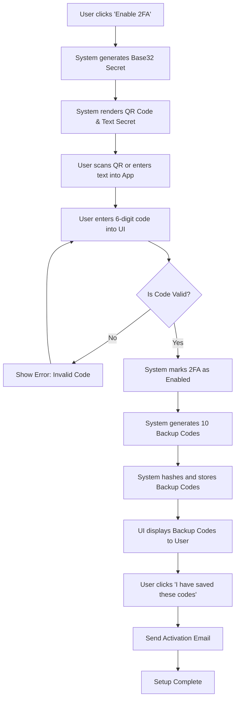

# Title & Metadata
**Feature / System Name**: TOTP Two-Factor Authentication (2FA) Setup
**Spec ID**: SPEC-SEC-042
**Version**: 1.0
**Status**: Draft
**Spec Type**: Functional Specification

# Overview & Purpose
The purpose of this feature is to allow registered users to secure their accounts using Time-Based One-Time Password (TOTP) Two-Factor Authentication (2FA). By enabling users to link an authenticator app (e.g., Google Authenticator, Authy, 1Password) to their account, we add a critical layer of security beyond the standard username and password, significantly reducing the risk of unauthorized access.

# Goals
*   Provide a self-serve, intuitive mechanism for users to enable TOTP 2FA on their accounts.
*   Achieve a 20% 2FA adoption rate among active users within 3 months of launch.
*   Reduce reported Account Takeover (ATO) incidents by 50% quarter-over-quarter.

# Target Users
*   **Registered Users**: Standard users seeking to secure their personal accounts.
*   **Administrators**: Elevated users who may eventually be required to use 2FA (though enforcement is out of scope for this specific setup spec).

# Stakeholders
*   **Product Management (Security)**: Feature owner and success metric tracking.
*   **CISO / Security Team**: Approval of cryptographic standards and implementation details.
*   **Customer Support**: Handling user lockouts and lost backup codes.

# Scope (In / Out)
**In Scope**:
*   Generation of a unique TOTP secret per user.
*   Display of the secret via a scannable QR code and a manual text string.
*   Verification of the initial 6-digit code to confirm successful app synchronization.
*   Generation and display of 10 single-use recovery backup codes.
*   Email notification to the user upon successful 2FA enablement.

**Out of Scope**:
*   SMS-based or Email-based One-Time Passwords (OTP).
*   Hardware security keys (WebAuthn / FIDO2).
*   Mandatory 2FA enforcement policies (e.g., forcing all admins to enable it).
*   The 2FA disablement or reset flow (to be covered in SPEC-SEC-043).
*   The login flow integration (to be covered in SPEC-SEC-044).

# MoSCoW Prioritization
*   **Must Have**: QR code generation, manual secret key display, TOTP code validation (with +/- 1 step clock skew allowance), backup code generation, secure database storage of secrets and backup hashes.
*   **Should Have**: "Copy to clipboard" functionality for the manual secret and backup codes, email alert on activation.
*   **Could Have**: Ability to download backup codes as a `.txt` file.
*   **Won't Have**: Integration with third-party SSO 2FA enforcement (e.g., Google Workspace).

# Functional Requirements
*   **FR1: Secret Generation**: The system shall generate a unique, cryptographically secure 160-bit Base32 secret for the user upon initiating the setup flow.
*   **FR2: QR Code Rendering**: The system shall encode the secret into a standard `otpauth://totp/` URI and render it as a QR code image.
*   **FR3: Code Verification**: The system shall validate a 6-digit TOTP code input by the user against the generated secret, allowing for a 30-second clock skew (1 step before and after).
*   **FR4: Backup Code Generation**: Upon successful verification of the TOTP code, the system shall generate 10 unique, 8-character alphanumeric backup codes.
*   **FR5: Secure Storage**: The system shall encrypt the TOTP secret at rest (AES-256) and hash the backup codes (bcrypt) before storing them in the database.
*   **FR6: State Management**: The system shall not mark 2FA as "enabled" on the user's profile until the initial 6-digit code is successfully verified.

# User Stories
**Story 1: Scan QR Code**
As a registered user
I want to scan a QR code with my authenticator app
So that I can easily link my account without manually typing a long secret key.
*   **Given** I am on the 2FA setup page
*   **When** the page loads
*   **Then** I should see a clearly visible QR code and instructions to scan it with an authenticator app.

**Story 2: Manual Entry Fallback**
As a registered user who cannot scan a QR code
I want to view and copy the text-based secret key
So that I can manually enter it into my authenticator app.
*   **Given** I am on the 2FA setup page
*   **When** I look below the QR code
*   **Then** I should see the Base32 secret key in plain text with a "Copy" button.

**Story 3: Verify Setup**
As a registered user
I want to enter a 6-digit code generated by my app to complete the setup
So that I know my app is correctly synchronized with the system.
*   **Given** I have scanned the QR code or entered the secret
*   **When** I enter the current 6-digit code from my app and submit
*   **Then** the system should verify the code and proceed to the backup codes screen.

**Story 4: Save Backup Codes**
As a registered user
I want to receive backup recovery codes
So that I can access my account if I lose my phone or authenticator app.
*   **Given** I have successfully verified my initial TOTP code
*   **When** the system transitions to the final setup step
*   **Then** I should be presented with 10 single-use backup codes and options to copy or download them.

# Inputs, Outputs & Data Flow
**Inputs**:
*   User Session Token (Implicit via authentication).
*   6-digit TOTP code (String, numeric only).
*   User confirmation of saving backup codes (Boolean).

**Outputs**:
*   QR Code (SVG or Base64 PNG).
*   Base32 Secret (String).
*   Array of 10 Backup Codes (Strings).
*   Success/Error UI messages.
*   Transactional Email (Activation confirmation).

**Data Entities / Models Touched**:
*   `User`:
    *   Update `totp_secret` (String, encrypted).
    *   Update `is_2fa_enabled` (Boolean).
*   `BackupCode`:
    *   Insert 10 new records: `user_id` (UUID), `code_hash` (String), `is_used` (Boolean, default false).

# Flows & Diagrams

# Edge Cases & Error States
*   **Edge Case 1: Invalid or Expired Code**: User enters a code that does not match the current time window.
    *   *Handling*: Display inline error: "Invalid or expired code. Please try again." Do not clear the input field entirely, but highlight it in red.
*   **Edge Case 2: Setup Abandonment**: User navigates away from the page after the QR code is generated but before verifying the 6-digit code.
    *   *Handling*: The generated secret is held in a temporary state (or session). It is *not* saved to the active user profile. If the user restarts the flow, a brand new secret is generated.
*   **Edge Case 3: Clock Skew**: The user's device time is slightly out of sync with the server.
    *   *Handling*: The backend TOTP validation must accept codes from the current 30-second window, the previous window, and the next window (total 90-second validity).
*   **Edge Case 4: 2FA Already Enabled**: User attempts to access the setup URL directly when 2FA is already active.
    *   *Handling*: Redirect the user to the 2FA Management/Settings page with a flash message: "Two-Factor Authentication is already enabled."

# Acceptance Criteria
*   **Given** a user initiates 2FA setup, **When** the page loads, **Then** a unique QR code and Base32 secret must be displayed.
*   **Given** the user is verifying their app, **When** they enter an incorrect 6-digit code, **Then** the system must reject it, display an error message, and keep `is_2fa_enabled` as false.
*   **Given** the user is verifying their app, **When** they enter a correct 6-digit code, **Then** the system must accept it, update `is_2fa_enabled` to true, and display 10 backup codes.
*   **Given** the backup codes are generated, **When** they are saved to the database, **Then** they must be hashed using bcrypt and never stored in plain text.
*   **Given** the user completes the setup flow, **When** they click the final confirmation button, **Then** an email must be dispatched to their registered email address confirming 2FA is active.

# Non-Functional Requirements
*   **Security**:
    *   TOTP implementation must comply with RFC 6238.
    *   Secrets must be encrypted at rest using AES-256.
    *   The setup page must require a recent authentication (sudo mode); if the user logged in more than 15 minutes ago, they must be prompted to re-enter their password before accessing the setup page.
*   **Performance**: QR code generation and rendering must complete in under 500ms to prevent UI stutter.
*   **Accessibility**: The QR code image must have appropriate `alt` text (e.g., "QR code for 2FA setup"). The manual entry text must be easily readable by screen readers.

# Assumptions
*   *Platform Context*: Assuming a standard modern web application stack (e.g., Node.js/React or similar) utilizing standard cryptographic libraries for TOTP and bcrypt.
*   The application already has a secure, authenticated user session mechanism.
*   The application has an existing transactional email service configured to send the activation notifications.

# Dependencies
*   Backend library for TOTP generation and validation (e.g., `otplib` or equivalent).
*   Frontend or Backend library for QR code generation (e.g., `qrcode`).
*   Transactional email provider (e.g., SendGrid, AWS SES).

# Open Questions
*   What is the exact marketing/support copy required for the 2FA activation confirmation email?
*   Do we want to enforce a maximum number of failed verification attempts during setup before temporarily locking the setup flow to prevent brute-forcing?
*   Should the downloaded backup codes `.txt` file follow a specific naming convention (e.g., `[App_Name]_Backup_Codes_[Date].txt`)?

# Success Metrics
*   **Adoption Rate**: 20% of Monthly Active Users (MAU) successfully complete the 2FA setup flow within 90 days of feature release.
*   **Setup Success Rate**: > 95% of users who generate a QR code successfully complete the verification step (a lower number indicates UX friction or poor instructions).
*   **Security Impact**: 50% reduction in reported Account Takeover (ATO) tickets to Customer Support.